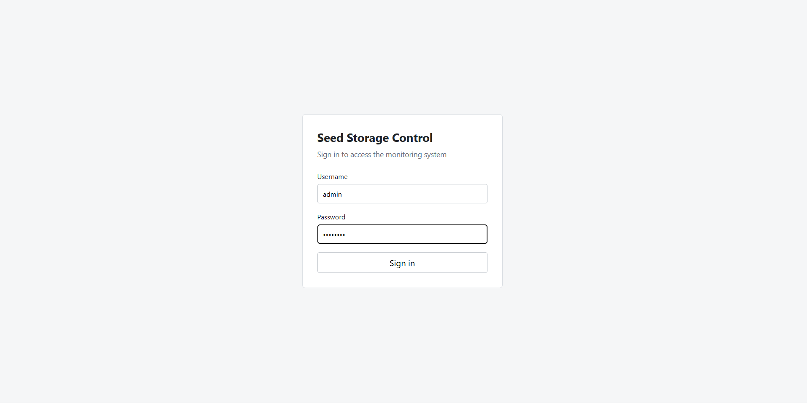
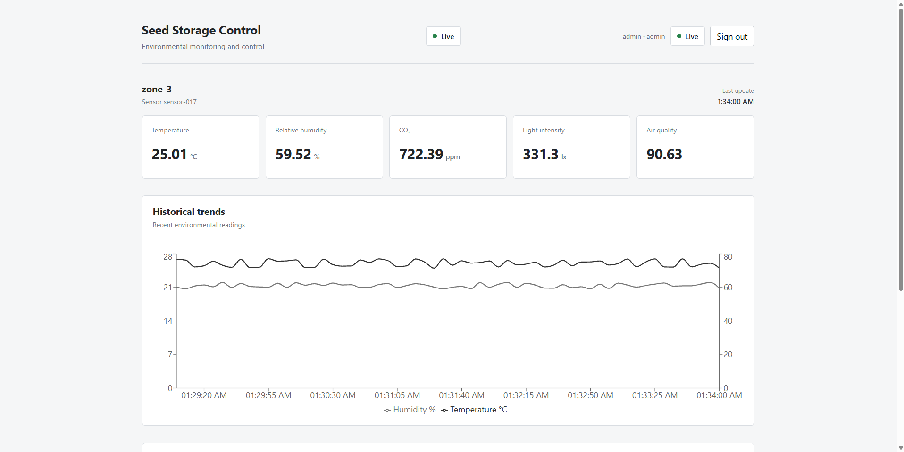
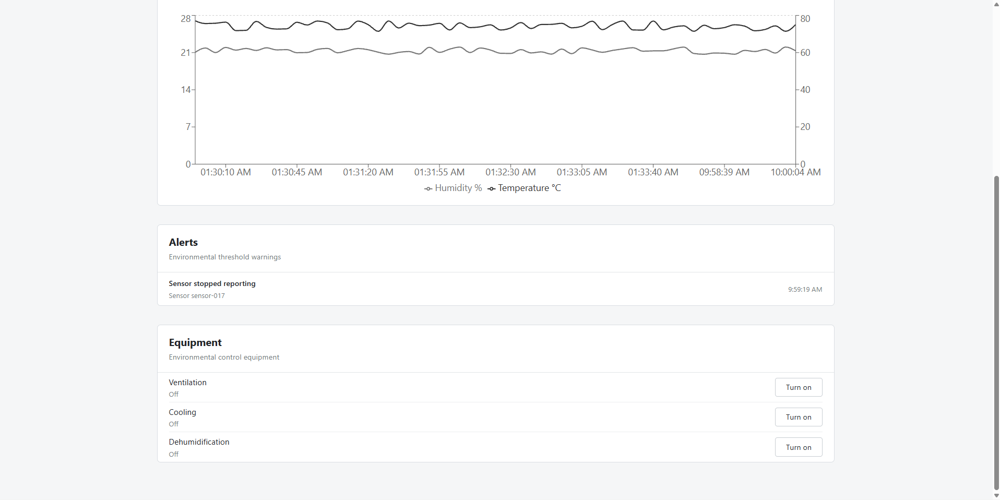

# Smart Seed Storage IoT Platform

A working IoT prototype for monitoring and controlling environmental conditions inside a seed storage facility.

The system receives sensor data through MQTT, stores readings in PostgreSQL, and updates a React dashboard in real time.

It also supports equipment control, alerts, sensor dropout detection, authentication, and role-based access.

## Screenshots

### Login



### Live Dashboard



### Alerts and Equipment Control



## Architecture

### Telemetry Flow

```text
┌────────────────────┐
│  Sensor Simulator  │
└─────────┬──────────┘
          │ MQTT telemetry
          ▼
┌────────────────────┐
│  Mosquitto Broker  │
└─────────┬──────────┘
          │
          ▼
┌──────────────────────────────┐
│   Node.js / Express Backend  │
└───────┬────────────────┬─────┘
        │                │
        │ Store readings │ Live updates
        ▼                ▼
┌───────────────┐   ┌──────────────────┐
│  PostgreSQL   │   │  React Dashboard │
└───────────────┘   └──────────────────┘
```

### Control Flow

```text
┌──────────────────┐
│  React Dashboard │
└─────────┬────────┘
          │ REST API
          ▼
┌──────────────────────────────┐
│   Node.js / Express Backend  │
└─────────┬────────────────────┘
          │ MQTT command
          ▼
┌──────────────────────┐
│ Controller Simulator │
└─────────┬────────────┘
          │ MQTT status
          ▼
┌──────────────────────────────┐
│   Node.js / Express Backend  │
└─────────┬────────────────────┘
          │ WebSocket update
          ▼
┌──────────────────┐
│  React Dashboard │
└──────────────────┘
```

## Features

- Live environmental telemetry
- Temperature, humidity, CO2, light, and air quality monitoring
- PostgreSQL historical storage
- WebSocket live updates
- Historical temperature and humidity charts
- Ventilation, cooling, and dehumidification control
- Controller acknowledgement for equipment commands
- Environmental threshold alerts
- Sensor dropout detection
- JWT authentication
- Viewer, Operator, and Admin roles
- Authenticated MQTT connections
- Docker-based PostgreSQL and Mosquitto services

## How It Works

The sensor simulator publishes telemetry to Mosquitto using MQTT.

The backend subscribes to the telemetry topic, stores each reading in PostgreSQL, and sends new readings to the dashboard through WebSocket.

Historical readings are loaded through the REST API.

Equipment commands follow this flow:

```text
Dashboard
→ REST API
→ Backend
→ MQTT
→ Controller
```

The controller reports its new state back through MQTT.

The dashboard updates the equipment state only after that confirmation is received.

## MQTT Topics

Telemetry:

```text
seed-storage/{zoneId}/{sensorId}/telemetry
```

Equipment commands:

```text
seed-storage/{zoneId}/controller/commands/{equipment}
```

Controller status:

```text
seed-storage/{zoneId}/controller/status
```

MQTT QoS 1 is used for telemetry and equipment commands.

## Tech Stack

### Backend

- Node.js
- Express
- MQTT.js
- WebSocket
- JWT
- bcrypt

### Frontend

- React
- Vite
- Recharts

### Data and Infrastructure

- PostgreSQL
- Eclipse Mosquitto
- Docker
- Docker Compose

## Authentication and Roles

The backend uses JWT authentication.

### Viewer

Can monitor the system.

Cannot control equipment.

### Operator

Can monitor the system and control equipment.

### Admin

Has equipment control access and can be extended with configuration permissions.

Authorization is enforced by the backend.

The frontend hides controls based on the user's role, but the backend performs the actual permission check.

## Alerts

Incoming readings are checked against configured thresholds.

The prototype monitors:

- Temperature
- Relative humidity
- CO2

The backend also tracks when each sensor was last seen.

If a sensor stops reporting for the configured timeout, a dropout alert is sent to the dashboard.

## Security

The prototype includes:

- bcrypt password hashing
- JWT authentication
- Role-based API authorization
- Protected equipment endpoints
- MQTT username and password authentication
- Anonymous MQTT access disabled
- Environment variables for secrets
- Equipment command validation

A production deployment would also use TLS, per-client MQTT ACLs, production secret management, and persistent user accounts.

## Project Structure

```text
smart-seed-storage-iot/
├── backend/
│   ├── server.js
│   ├── mqttClient.js
│   ├── db.js
│   └── auth.js
│
├── frontend/
│   └── React dashboard
│
├── simulator/
│   ├── sensor.js
│   └── controller.js
│
├── infrastructure/
│   ├── mosquitto/
│   └── postgres/
│
├── screenshots/
│   ├── login.png
│   ├── dashboard.png
│   └── alerts-equipment.png
│
├── docker-compose.yml
└── README.md
```

## Run Locally

Start PostgreSQL and Mosquitto:

```bash
docker compose up -d
```

Start the backend:

```bash
cd backend
npm install
node server.js
```

Start the sensor simulator:

```bash
cd simulator
npm install
node sensor.js
```

Start the controller simulator in another terminal:

```bash
cd simulator
node controller.js
```

Start the frontend:

```bash
cd frontend
npm install
npm run dev
```

The dashboard normally runs at:

```text
http://localhost:5173
```

The backend runs at:

```text
http://localhost:3000
```

## Environment Variables

The backend uses:

```text
DATABASE_URL
JWT_SECRET
MQTT_USERNAME
MQTT_PASSWORD
```

The simulator uses:

```text
MQTT_USERNAME
MQTT_PASSWORD
```

Private `.env` files and the Mosquitto password file are not committed to the repository.

## Current Scope

This is a working prototype, not a production-ready deployment.

The sensor and controller are software simulators.

No physical ESP32, Raspberry Pi, or industrial controller is required to run the project.

The current version focuses on the main IoT data flow, monitoring, control, alerts, authentication, and broker access.